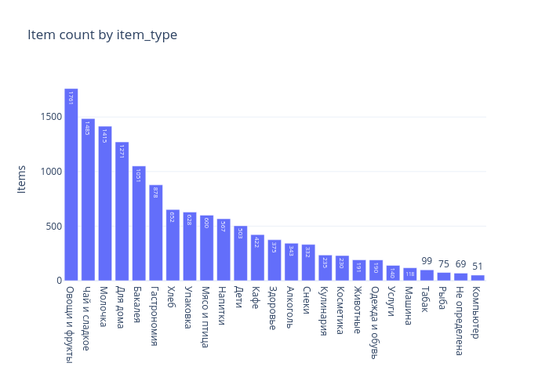
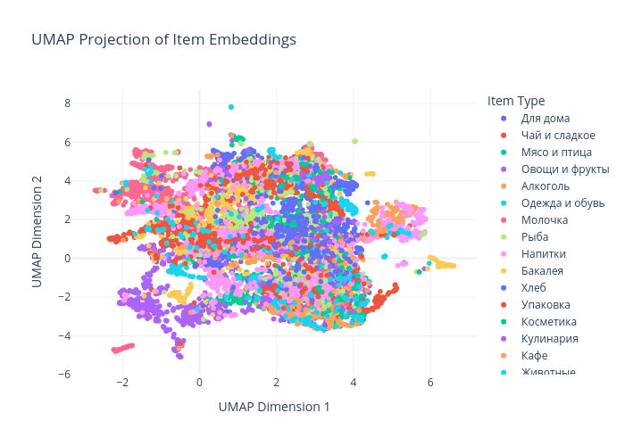
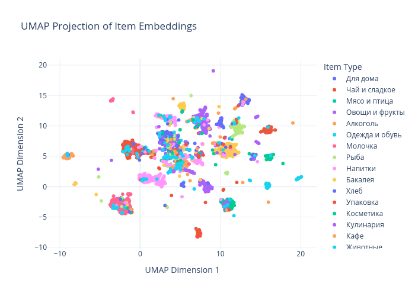
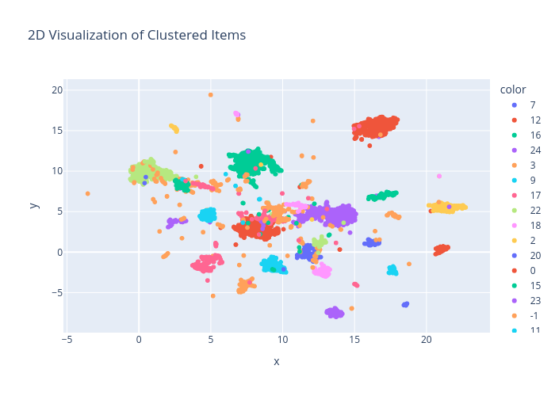

# HW 1

## Описание
Скрипты для скраппинга, предобработки и анализа датасета с чеками

## Источники
- Открытые данные - [открытый датасет](https://dremovd.github.io/receipt-data/#-) с позициями чека, размеченными по категориям
- Скраппинг - [МОИ ЧЕКИ ОНЛАЙН](https://lkdr.nalog.ru/)

## Возможное применение
- Классификация товаров по названию
- Анализ продуктовой корзины
- Реклама и рекомендательные системы

## Эксплоративный анализ

Общая статистика
```
shape: (9, 9)
┌───────────┬───────────┬───────────┬───────────┬───────────┬──────────┬──────────┬──────────┬──────────┐
│ statistic ┆ basket_id ┆ timestamp ┆ brand_nam ┆ brand_typ ┆ item     ┆ item_pri ┆ item_qua ┆ item_typ │
│ ---       ┆ ---       ┆ ---       ┆ e         ┆ e         ┆ ---      ┆ ce       ┆ ntity    ┆ e        │
│ str       ┆ f64       ┆ str       ┆ ---       ┆ ---       ┆ str      ┆ ---      ┆ ---      ┆ ---      │
│           ┆           ┆           ┆ str       ┆ str       ┆          ┆ f64      ┆ f64      ┆ str      │
╞═══════════╪═══════════╪═══════════╪═══════════╪═══════════╪══════════╪══════════╪══════════╪══════════╡
│ count     ┆ 14284.0   ┆ 602       ┆ 602       ┆ 602       ┆ 14278    ┆ 14279.0  ┆ 14279.0  ┆ 13682    │
│ null_coun ┆ 0.0       ┆ 13682     ┆ 13682     ┆ 13682     ┆ 6        ┆ 5.0      ┆ 5.0      ┆ 602      │
│ t         ┆           ┆           ┆           ┆           ┆          ┆          ┆          ┆          │
│ mean      ┆ 1804.8589 ┆ 2023-07-2 ┆ null      ┆ null      ┆ null     ┆ 169.6928 ┆ 1.426401 ┆ null     │
│           ┆ 33        ┆ 3 22:10:3 ┆           ┆           ┆          ┆ 67       ┆          ┆          │
│           ┆           ┆ 7.076412  ┆           ┆           ┆          ┆          ┆          ┆          │
│ std       ┆ 1167.8320 ┆ null      ┆ null      ┆ null      ┆ null     ┆ 1897.619 ┆ 2.460231 ┆ null     │
│           ┆ 9         ┆           ┆           ┆           ┆          ┆ 561      ┆          ┆          │
│ min       ┆ 0.0       ┆ 2020-08-1 ┆ KFC       ┆ Выдача и  ┆          ┆ 0.0      ┆ 0.045    ┆ Алкоголь │
│           ┆           ┆ 4         ┆           ┆ прием     ┆          ┆          ┆          ┆          │
│           ┆           ┆ 13:35:00  ┆           ┆ посылок   ┆          ┆          ┆          ┆          │
│ 25%       ┆ 751.0     ┆ 2022-07-0 ┆ null      ┆ null      ┆ null     ┆ 30.69    ┆ 1.0      ┆ null     │
│           ┆           ┆ 6         ┆           ┆           ┆          ┆          ┆          ┆          │
│           ┆           ┆ 08:27:00  ┆           ┆           ┆          ┆          ┆          ┆          │
│ 50%       ┆ 1895.0    ┆ 2023-10-2 ┆ null      ┆ null      ┆ null     ┆ 59.89    ┆ 1.0      ┆ null     │
│           ┆           ┆ 9         ┆           ┆           ┆          ┆          ┆          ┆          │
│           ┆           ┆ 07:26:00  ┆           ┆           ┆          ┆          ┆          ┆          │
│ 75%       ┆ 2805.0    ┆ 2024-10-2 ┆ null      ┆ null      ┆ null     ┆ 129.0    ┆ 1.0      ┆ null     │
│           ┆           ┆ 0         ┆           ┆           ┆          ┆          ┆          ┆          │
│           ┆           ┆ 15:44:00  ┆           ┆           ┆          ┆          ┆          ┆          │
│ max       ┆ 3943.0    ┆ 2025-04-1 ┆ Яндекс.Та ┆ Услуги    ┆ яйцо 2с  ┆ 192800.0 ┆ 66.07    ┆ Чай и    │
│           ┆           ┆ 7         ┆ кси       ┆ сотовой   ┆ куриное  ┆          ┆          ┆ сладкое  │
│           ┆           ┆ 16:52:00  ┆           ┆ связи     ┆ Ясенка   ┆          ┆          ┆          │
└───────────┴───────────┴───────────┴───────────┴───────────┴──────────┴──────────┴──────────┴──────────┘
```

Семпл данных
```
Rows: 14284
Columns: 8
$ basket_id              <i64> 0, 0, 0, 0, 0, 0, 1, 1, 1, 1
$ timestamp     <datetime[μs]> 2025-03-22 14:58:00, 2025-03-22 14:58:00, 2025-03-22 14:58:00, 2025-03-22 
14:58:00, 2025-03-22 14:58:00, 2025-03-22 14:58:00, 2025-03-22 14:41:00, 2025-03-22 14:41:00, 2025-03-22 
14:41:00, 2025-03-22 14:41:00
$ brand_name             <str> 'Самокат', 'Самокат', 'Самокат', 'Самокат', 'Самокат', 'Самокат', 'Самокат
', 'Самокат', 'Самокат', 'Самокат'
$ brand_type             <str> 'Доставка еды/продуктов', 'Доставка еды/продуктов', 'Доставка еды/продукто
в', 'Доставка еды/продуктов', 'Доставка еды/продуктов', 'Доставка еды/продуктов', 'Доставка еды/продуктов
', 'Доставка еды/продуктов', 'Доставка еды/продуктов', 'Доставка еды/продуктов'
$ item                   <str> 'Батончик Kitkat, 41,5 г', 'Слойки Смак, с сыром, 2 шт., 180 г', 'Слойки С
мак, с сыром, 2 шт., 180 г', 'Вода Святой Источник, лимон, без газа, 1,5 л', 'Вода Святой Источник, лимон
, без газа, 1,5 л', 'Шоколадный батончик Snickers Super, 80 г', 'Вода Святой Источник, лимон, без газа, 1
,5 л', 'Вода Святой Источник, лимон, без газа, 1,5 л', 'Батончик Kitkat, 41,5 г', 'Шоколадный батончик Sn
ickers Super, 80 г'
$ item_price             <f64> 129.0, 95.0, 95.0, 99.0, 99.0, 89.0, 99.0, 99.0, 129.0, 89.0
$ item_quantity          <f64> 1.0, 1.0, 1.0, 1.0, 1.0, 1.0, 1.0, 1.0, 1.0, 1.0
$ item_type              <str> None, None, None, None, None, None, None, None, None, None

shape: (14, 2)
```

Количество брендов
```
┌────────────────┬───────┐
│ brand_name     ┆ count │
│ ---            ┆ ---   │
│ str            ┆ u32   │
╞════════════════╪═══════╡
│ МТС            ┆ 202   │
│ Яндекс.Такси   ┆ 144   │
│ Самокат        ┆ 96    │
│ KFC            ┆ 50    │
│ Деливери клаб  ┆ 42    │
│ Лента          ┆ 24    │
│ Яндекс.Еда     ┆ 20    │
│ Почта России   ┆ 8     │
│ Эр Телеком     ┆ 5     │
│ Озон           ┆ 4     │
│ Золотое яблоко ┆ 2     │
│ Спортмастер    ┆ 2     │
│ Ситимобил      ┆ 2     │
│ ВК Пэй         ┆ 1     │
└────────────────┴───────┘
```

Количество разновидностей брендов
```
shape: (11, 2)
┌─────────────────────────────────┬───────┐
│ brand_type                      ┆ count │
│ ---                             ┆ ---   │
│ str                             ┆ u32   │
╞═════════════════════════════════╪═══════╡
│ Услуги сотовой связи            ┆ 202   │
│ Доставка еды/продуктов          ┆ 158   │
│ Заказ такси                     ┆ 146   │
│ Рестораны/доставка продуктов п… ┆ 50    │
│ Супермаркет                     ┆ 24    │
│ Выдача и прием посылок          ┆ 8     │
│ Телекоммуникации и интернет     ┆ 5     │
│ Интернет магазин                ┆ 4     │
│ Торговля парфюмерией и космети… ┆ 2     │
│ Спортивные товары               ┆ 2     │
│ Платежный сервис                ┆ 1     │
└─────────────────────────────────┴───────┘
```

Количество типов товаров
```
shape: (25, 2)
┌────────────────┬───────┐
│ item_type      ┆ count │
│ ---            ┆ ---   │
│ str            ┆ u32   │
╞════════════════╪═══════╡
│ Овощи и фрукты ┆ 1761  │
│ Чай и сладкое  ┆ 1485  │
│ Молочка        ┆ 1415  │
│ Для дома       ┆ 1271  │
│ Бакалея        ┆ 1051  │
│ Гастрономия    ┆ 878   │
│ Хлеб           ┆ 652   │
│ Упаковка       ┆ 628   │
│ Мясо и птица   ┆ 600   │
│ Напитки        ┆ 567   │
│ Дети           ┆ 503   │
│ Кафе           ┆ 422   │
│ Здоровье       ┆ 375   │
│ Алкоголь       ┆ 343   │
│ Снеки          ┆ 332   │
│ Кулинария      ┆ 235   │
│ Косметика      ┆ 230   │
│ Животные       ┆ 191   │
│ Одежда и обувь ┆ 190   │
│ Услуги         ┆ 140   │
│ Машина         ┆ 118   │
│ Табак          ┆ 99    │
│ Рыба           ┆ 75    │
│ Не определена  ┆ 70    │
│ Компьютер      ┆ 51    │
└────────────────┴───────┘
```

Названия и типы товаров - наиболее важные для нас данные. В дальнешей работе мы будем предсказывать типы товаров по названию,
так что название будет нашим признаком, а тип - таргетом.

При этом сохраним несколько других признаков на будущее - они могут быть полезны при анализе, feature-инжиниренге,
или будут нужны если мы будем решать другую задачу - например предсказывать продуктовые корзины.


## Визуализация
Большой дисбаланс целевых классов сразу бросается в глаза, это стоит учеть при обучении и тестировании модели



Внесем дополнительные фичи - эмбэддинги названий товаров.
Визуализируем эмбэддинги навзаний, раскрасим по типу товара
Для удобного отображения на двумерное пространство мы используем UMAP


Точки одного цвета собираются вместе, но недостаточно плотно.
Так как у нас есть метки классов для части данных, мы можем задействовать их в Semi-Supervised UMAP.
В этом случае алгоритм будет учитывать таргет при определении соседства между точками


Теперь мы лучше видим группы товаров одного типа.
При дальнейшем изучении заметим, что товары с неизвестным типом довольно часто попадают в "родную" группу товаров.
Это может помочь нам потом при устранении пропусков в данных.

В дальнешем мы можем использовать HDBSCAN для выделения кластеров в наших товарах.
Вы можете увидеть точки, которые стоят отдаленно от других групп точек.
Такие точки не будут принадлежать ни одному кластеру и будут считаться выбросами.
Так же мы можем увидеть небольшие вкрапления точек другого цвета в группах точек одного цвета.
Это точки, явно оказавшиеся не в "своей" группе. Мы можем смело считать их выбросами.

Таким образом, использование эмбеддингов и UMAP позволило нам:
1. Представить данные в удобном для восприятия виде, что помогло выявить интересные особенности.
2. Использовать эти особенности для повышения качества датасета, включая обработку пропусков и выбросов.

# HW 2

## Пропуски

Посчитаем количество пропуском для каждого столбца
```
shape: (1, 8)
┌───────────┬───────────┬────────────┬────────────┬──────┬────────────┬───────────────┬───────────┐
│ basket_id ┆ timestamp ┆ brand_name ┆ brand_type ┆ item ┆ item_price ┆ item_quantity ┆ item_type │
│ ---       ┆ ---       ┆ ---        ┆ ---        ┆ ---  ┆ ---        ┆ ---           ┆ ---       │
│ u32       ┆ u32       ┆ u32        ┆ u32        ┆ u32  ┆ u32        ┆ u32           ┆ u32       │
╞═══════════╪═══════════╪════════════╪════════════╪══════╪════════════╪═══════════════╪═══════════╡
│ 0         ┆ 13682     ┆ 13682      ┆ 13682      ┆ 6    ┆ 5          ┆ 5             ┆ 602       │
└───────────┴───────────┴────────────┴────────────┴──────┴────────────┴───────────────┴───────────┘
```

Для части столбцов причина достаточно очевидна - мы склеили два датасета, на 13682 строки и на 602 строки.
В одном не было timestamp, brand_name, brand_type, в другом не было item_type

Насчет других пропусков все интереснее.
Схожее количество пропусков у item намекает, что у нескольких строчек отсутствует предмет и его данные.
Но возможно это просто предположение, мы видим паттерн там где его нет и на самом деле пропуски более хаотичны.

```
shape: (6, 8)
┌───────────┬──────────────┬──────────────┬──────────────┬──────┬────────────┬─────────────┬─────────────┐
│ basket_id ┆ timestamp    ┆ brand_name   ┆ brand_type   ┆ item ┆ item_price ┆ item_quanti ┆ item_type   │
│ ---       ┆ ---          ┆ ---          ┆ ---          ┆ ---  ┆ ---        ┆ ty          ┆ ---         │
│ i64       ┆ datetime[μs] ┆ str          ┆ str          ┆ str  ┆ f64        ┆ ---         ┆ str         │
│           ┆              ┆              ┆              ┆      ┆            ┆ f64         ┆             │
╞═══════════╪══════════════╪══════════════╪══════════════╪══════╪════════════╪═════════════╪═════════════╡
│ 13863     ┆ 2023-12-22   ┆ Яндекс.Такси ┆ Заказ такси  ┆ null ┆ null       ┆ null        ┆ null        │
│           ┆ 10:01:00     ┆              ┆              ┆      ┆            ┆             ┆             │
│ 13866     ┆ 2024-01-01   ┆ МТС          ┆ Услуги       ┆ null ┆ null       ┆ null        ┆ null        │
│           ┆ 15:43:00     ┆              ┆ сотовой      ┆      ┆            ┆             ┆             │
│           ┆              ┆              ┆ связи        ┆      ┆            ┆             ┆             │
│ 13868     ┆ 2023-12-23   ┆ Яндекс.Такси ┆ Заказ такси  ┆ null ┆ null       ┆ null        ┆ null        │
│           ┆ 08:35:00     ┆              ┆              ┆      ┆            ┆             ┆             │
│ 13870     ┆ 2023-12-19   ┆ МТС          ┆ Услуги       ┆ null ┆ null       ┆ null        ┆ null        │
│           ┆ 15:38:00     ┆              ┆ сотовой      ┆      ┆            ┆             ┆             │
│           ┆              ┆              ┆ связи        ┆      ┆            ┆             ┆             │
│ 13873     ┆ 2023-12-19   ┆ МТС          ┆ Услуги       ┆ null ┆ null       ┆ null        ┆ null        │
│           ┆ 18:22:00     ┆              ┆ сотовой      ┆      ┆            ┆             ┆             │
│           ┆              ┆              ┆ связи        ┆      ┆            ┆             ┆             │
│ 997       ┆ null         ┆ null         ┆ null         ┆ null ┆ 302.0      ┆ 1.0         ┆ Не          │
│           ┆              ┆              ┆              ┆      ┆            ┆             ┆ определена  │
└───────────┴──────────────┴──────────────┴──────────────┴──────┴────────────┴─────────────┴─────────────┘
```

Все таки видим что мы были правы. У части строк потерялся айтем и связанная информация.
Это та часть датасета, которую мы набирали скраппингом. Т.к сбор чека и деталей о нем - два разных процесса, мы могли просто не собрать детали о чеке.
Или эти данные отсутствовали в исходной базе данных.
Часть информации о товаре потерялась и в датасете, что мы скачали из открытых источников.
При этом, у товара по факту нет типа, но вместо null он обозначен как "не определен", что могло вызвать неочевидные проблемы, если бы мы не заметили и не починили это.
Исправим это заменой значений.

Часть пропущенных значений нас пока не интересует - оставим их таковыми.
Но что-то надо сделатаь с ~600 отсутсвующими целевыми классами. Мы можем просто удалить их, но потеряем часть данных.
Лучше попробуем восстановить эти значения с помощью кластеризации - присудим товару мажоритарный тип кластера.


# Выбросы
В открытый датасет попало некоторое количество сторонних фрагментов чека (пр. Итого, ПРИХОД), такие вещи, скорее всего, придется чистить вручную.
В ценах сильных выбросов нет - просто крайне дорогие покупки.
Есть странная покупка вида `0001 ГРУППА 1` на сумму 192800 руб. Возможно это тоже фрагмент чека, таких товаров несколько в датасете.
О quantity делать выводы трудно, там намешаны все возможные единицы измерения (при этом восстановить их - отдельная интересная задача), но ничего подозрительного не замечено.
Нас интересуют больше категориальные выбросы - возможно есть какие-то ошибки в строковых названиях категорий - это может выйти боком.
Но кроме категории "Не определена" проблем нет.

Еще одна потенциальная проблема - неправильно определенная категория товара.
Мы замечали такое, когда визуализировали датасет, и даже пришли к какому-то алгоритму борьбы с такими выбросами с помощью кластеризации.
Если товар имеет тип - и этот тип не совпадает с мажоритарным типом кластера - уберем такой товар из выборки.
Все товары, определенные алгоритмом кластеризации как выбросы - тоже уберем из датасета.
Мы можем не убирать их насегда, а просто отдать специалисту для дальнешей проверки, но пока стоит вынести их из обучающей выборки.

(заполнения пропусков и очистка от выбросов находится в файле `clean.py`)

Визуализация кластеризации

